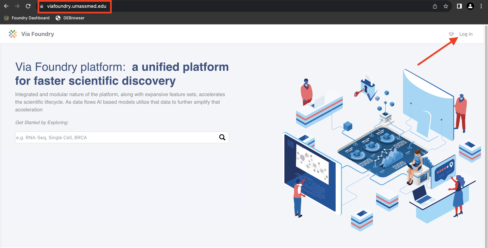
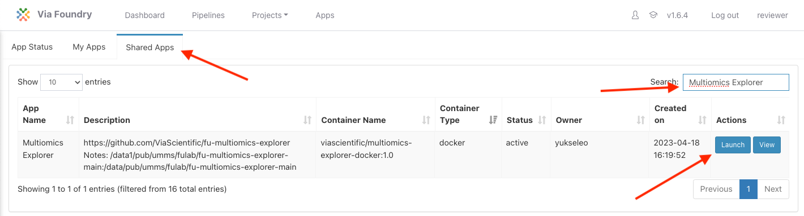
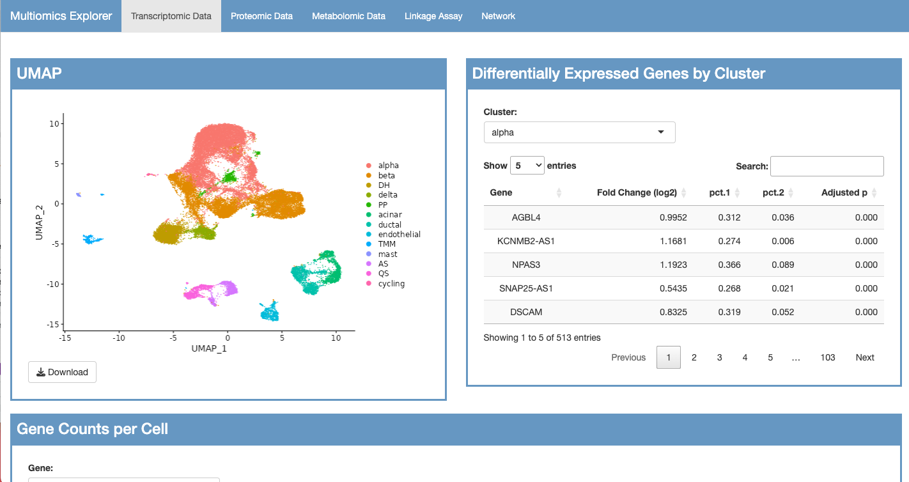

# Viewing Multiomics Explorer App on Foundry

1. Navigate to `https://viafoundry.umassmed.edu/`

2. In upper right corner, click `Log in`

<p align="center">  </p>

3. Enter username and password. Click `Login`

<p align="center">  </p>

4. On top banner, click `Apps` tab

<p align="center">  </p>

5. In the `Shared Apps` tab, search for `Multiomics Explorer`; Click `Launch`

<p align="center">  </p>

**Warning:** Your browser may block the pop-up. Each browser is different, but usually the browser will alert you to a blocked pop-up in the top right of the url bar and will provide some way to override the pop-up blocking for this webpage. Once you allow pop-ups, you will need to re-launch the app.

<p align="center">  </p>

6. The app will launch in a new window.

<p align="center">  </p>

# Viewing Multiomics Explorer App Locally

## System Requirements

### Hardware Requirements

The explorer requires only a standard computer with enough RAM to support the in-memory operations.

### Software Requirements

#### OS Requirements

The explorer is supported for macOS and Linux. The package has been tested on the following systems:

* macOS: Sequoia (15.5)
* Linux: Ubuntu (20.04.3 LTS)

#### R Dependencies

```
shiny
shinyBS
Seurat
cyjShiny
htmlwidgets
graph
jsonlite
igraph
tidyverse
DT
shinycssloaders
shinydashboard
```

### Installation Guide:

#### Install from Github

This code will clone the application from github and then download the input files. This will take about 2 minutes + the time it takes to download the input files (~3.2 Gb).

```
git clone https://github.com/ViaScientific/fu-multiomics-explorer.git
cd fu-multiomics-explorer/data
wget https://umms.dolphinnext.com/fulab/fu-multiomics-explorer-main/data/data.tar.gz
tar -xvf data.tar.gz
rm data.tar.gz
```

### Running Guide:

1. Open a terminal and execute the following command. You must replace `<path_to_clone_location>` with the path to the directory that contains the fu-multiomics-explorer directory that was downloaded from github.

  ```
  R -e "shiny::runApp('<path_to_clone_location>/fu-multiomics-explorer/app.R')"
  ```

2. From any browswer, navigate to [http://localhost:8789/](http://localhost:8789/). The app will take about 30 seconds to fully load.

#### Instructions for using your own data:

The following files can be replaced with your own data (names must be exact). Not all files are required to run each section.

```
data/clean/metabolomic_metadata.txt
data/clean/B1.txt
data/clean/full_network.cyjs
data/clean/proteomic_metadata.txt
data/processed/A1_processed.txt
data/clean/sc-rnaseq_features.rds
data/raw/seurat_integrated.rds
data/raw/DEG/organic/*_2vs11_organic.csv
data/clean/transcriptomic_metadata.txt
data/raw/RNA_Count_by_donor_and_samples_beta_cells.csv
```

### Additional Information

App-based analysis in the paper was performed in the following docker container: `viascientific/multiomics-explorer-docker:1.0` 

The following is the corresponding `sessionInfo()` while performing any analysis included in the paper:

```
R version 4.3.0 (2023-04-21)
Platform: x86_64-pc-linux-gnu (64-bit)
Running under: Ubuntu 20.04.3 LTS

Matrix products: default
BLAS:   /usr/lib/x86_64-linux-gnu/openblas-pthread/libblas.so.3 
LAPACK: /usr/lib/x86_64-linux-gnu/openblas-pthread/liblapack.so.3;  LAPACK version 3.9.0

locale:
 [1] LC_CTYPE=C.UTF-8       LC_NUMERIC=C           LC_TIME=C.UTF-8       
 [4] LC_COLLATE=C.UTF-8     LC_MONETARY=C.UTF-8    LC_MESSAGES=C.UTF-8   
 [7] LC_PAPER=C.UTF-8       LC_NAME=C              LC_ADDRESS=C          
[10] LC_TELEPHONE=C         LC_MEASUREMENT=C.UTF-8 LC_IDENTIFICATION=C   

time zone: Etc/UTC
tzcode source: system (glibc)

attached base packages:
[1] stats     graphics  grDevices utils     datasets  methods   base     

other attached packages:
 [1] shinydashboard_0.7.2  shinycssloaders_1.0.0 DT_0.28              
 [4] lubridate_1.9.2       forcats_1.0.0         stringr_1.5.0        
 [7] dplyr_1.1.2           purrr_1.0.1           readr_2.1.4          
[10] tidyr_1.3.0           tibble_3.2.1          ggplot2_3.4.2        
[13] tidyverse_2.0.0       igraph_1.4.3          cyjShiny_1.0.42      
[16] base64enc_0.1-3       graph_1.78.0          BiocGenerics_0.46.0  
[19] jsonlite_1.8.4        htmlwidgets_1.6.2     SeuratObject_4.1.3   
[22] Seurat_4.3.0          shinyBS_0.61.1        shiny_1.7.4          

loaded via a namespace (and not attached):
 [1] deldir_1.0-9           pbapply_1.7-0          gridExtra_2.3         
 [4] rlang_1.1.1            magrittr_2.0.3         RcppAnnoy_0.0.20      
 [7] matrixStats_0.63.0     ggridges_0.5.4         compiler_4.3.0        
[10] spatstat.geom_3.2-1    png_0.1-8              vctrs_0.6.2           
[13] reshape2_1.4.4         pkgconfig_2.0.3        fastmap_1.1.1         
[16] ellipsis_0.3.2         utf8_1.2.3             promises_1.2.0.1      
[19] tzdb_0.4.0             goftest_1.2-3          later_1.3.1           
[22] spatstat.utils_3.0-3   irlba_2.3.5.1          parallel_4.3.0        
[25] cluster_2.1.4          R6_2.5.1               ica_1.0-3             
[28] stringi_1.7.12         RColorBrewer_1.1-3     spatstat.data_3.0-1   
[31] reticulate_1.28        parallelly_1.35.0      lmtest_0.9-40         
[34] scattermore_1.1        Rcpp_1.0.10            tensor_1.5            
[37] future.apply_1.11.0    zoo_1.8-12             sctransform_0.3.5     
[40] timechange_0.2.0       httpuv_1.6.11          Matrix_1.5-1          
[43] splines_4.3.0          tidyselect_1.2.0       abind_1.4-5           
[46] spatstat.random_3.1-5  codetools_0.2-19       miniUI_0.1.1.1        
[49] spatstat.explore_3.2-1 listenv_0.9.0          lattice_0.21-8        
[52] plyr_1.8.8             withr_2.5.0            ROCR_1.0-11           
[55] Rtsne_0.16             future_1.32.0          survival_3.5-5        
[58] polyclip_1.10-4        fitdistrplus_1.1-11    pillar_1.9.0          
[61] KernSmooth_2.23-20     stats4_4.3.0           plotly_4.10.1         
[64] generics_0.1.3         sp_1.6-0               hms_1.1.3             
[67] munsell_0.5.0          scales_1.2.1           globals_0.16.2        
[70] xtable_1.8-4           glue_1.6.2             lazyeval_0.2.2        
[73] tools_4.3.0            data.table_1.14.8      RANN_2.6.1            
[76] leiden_0.4.3           cowplot_1.1.1          grid_4.3.0            
[79] colorspace_2.1-0       nlme_3.1-162           patchwork_1.1.2       
[82] cli_3.6.1              spatstat.sparse_3.0-1  fansi_1.0.4           
[85] viridisLite_0.4.2      uwot_0.1.14            gtable_0.3.3          
[88] digest_0.6.31          progressr_0.13.0       ggrepel_0.9.3         
[91] htmltools_0.5.5        lifecycle_1.0.3        httr_1.4.6            
[94] mime_0.12              MASS_7.3-59           
```
