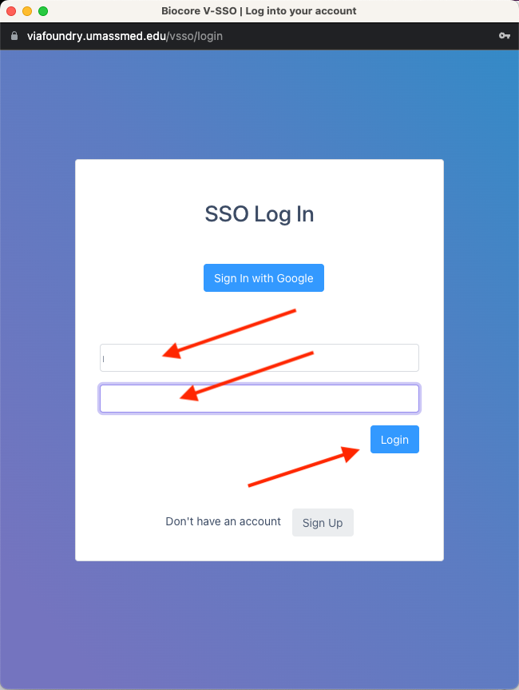
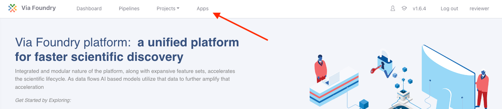
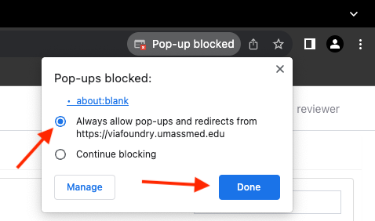

# Viewing Multiomics Explorer App

1. Navigate to `https://viafoundry.umassmed.edu/`

2. In upper right corner, click `Log in`

  

3. Enter username and password. Click `Login`

  

4. On top banner, click `Apps` tab

  

5. In the `Shared Apps` tab, search for `Multiomics Explorer`; Click `Launch`

  

**Warning:** Your browser may block the pop-up. Each browser is different, but usually the browser will alert you to a blocked pop-up in the top right of the url bar and will provide some way to override the pop-up blocking for this webpage. Once you allow pop-ups, you will need to re-launch the app.

  

6. The app will launch in a new window.

  

